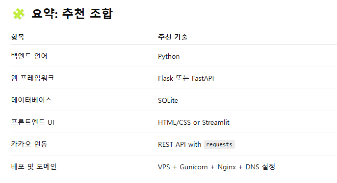

# 내가 하려는것
내가 가지고 있는 ```kimmich.kr``` 도메인을 사용하여 나의 개인 웹을 만들것이다
# 내 웹에 들어갈 목록
1. 카카오 캘린더에서 할일 목록 가져오기
2. 수면 패턴 기록기
3. 내 장부 기록
4. 오늘의 한 문장 / 하루 기록
5. 할 일 / 습관 추적기
### 이것들이 이제 다 내 DB에 들어가는게 내 목표


# 내가 해야 하는것들



🛠 시작 순서 제안
기능 설계 (DB 모델 설계)
예: 유저 → 장부 / 수면 / 기록 / 캘린더 항목

Flask로 기본 웹 구성
홈 + 각 기능 페이지 (입력/조회)

SQLite DB 연동
기능별 데이터 저장

카카오 캘린더 연동
OAuth 인증 → 할일 목록 가져오기 → DB 저장

도메인 연결
서버 배포 → 도메인 연결