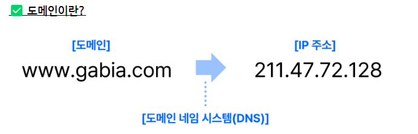
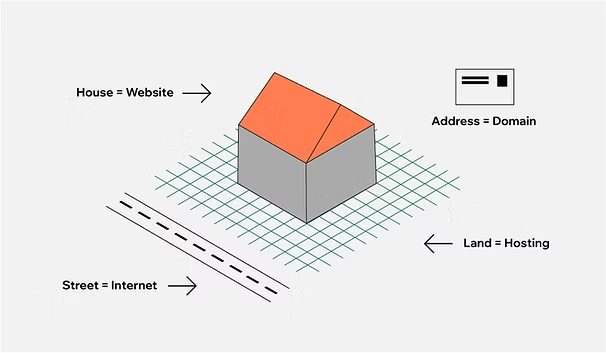
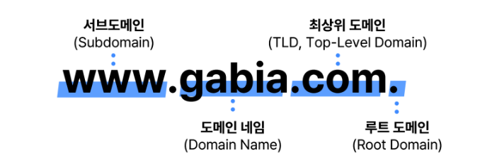
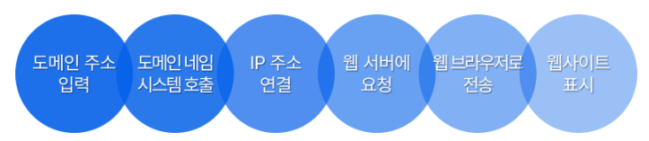

# 도메인
- 정의 == 인터넷 주소
- 도메인은 온라인상 위치를 나타내는 인터넷 프로토콜(IP)에 접근하기 위한 인간 친화적인 방식으로 만들어짐
## 도메인 특징
IP 주소는 0부터 255까지의 십진법 숫자를 마침표로 구분한 숫자 문자열로 모든 컴퓨터에 할당되어 있습니다
### IP주소란?

### 웹 호스팅 VS 도메인

- 웹 호스팅은 웹사이트가 저장되는 **서버 공간 (땅, 건물 전체)**과 유사
-> 그니까 모든 파일이 있는 곳이라고 생각을 하면 된다
- 도메인은 웹사이트의 **인터넷 주소 (집 주소)**와 유사
-> 그니까 그냥 웹에서 웹 호스팅에 올라간 위치에 들어가게 해주는 역활
-> 참고로 경로(/blogs)와 같이 사이트 마지막에 붙는 것들은 도메인 안에 있는 개념이다
## 도메인의 종류
- 도메인에는 여러가지 종류의 도메인이 있다
- 이런거는 굳이 알 필요가 없는거 같다
# 도메인 구조

### 루트 도메인(Root Domain)
사이트 마지막에 점이 있는 형태 실 생활에서는 이 점을 생략을 한다
### 최상위 도메인(TLD,top-level-domain)
루트 도메인 다음으로 최상위이다. 이거는 ".com",".net"과 같은 것을 의미한다
### 도메인 네임(domain name)
웹 사이트의 정체성을 나타낸다
### 서브 도메인(subdomain)
- "www"이런거를 나타냍다. 다만 이런거만을 의미하는게 아니라 "www.donggeon" 이런것도 서브 도메인이다. 서브 도메인은 유연하게 사용이 가능하여 특징을 만드는데 유용한 도메인이다
# 도메인 작동 원리

# 도메인 도입 방법

1. 도메인 구매
- 우리나라는 가비아가 유명함(썅 광고구만)
2. 도메인 네임 시스템 설정
- 도메인을 등록(구매)후에 웹사이트 파일을 저장하고 운영할 웹 호스팅 서비스 필요
-> 이렇게 연결을 해야 도메인 주소를 입력했을떄 웹사이트가 표시
3. 도메인 관리 및 갱신
- 1년주기로 연장
#### 참조
- ICANN(Internet Corporation for Assigned Names and Numbers)
-> 여기서 모든 도메인을 관리한다