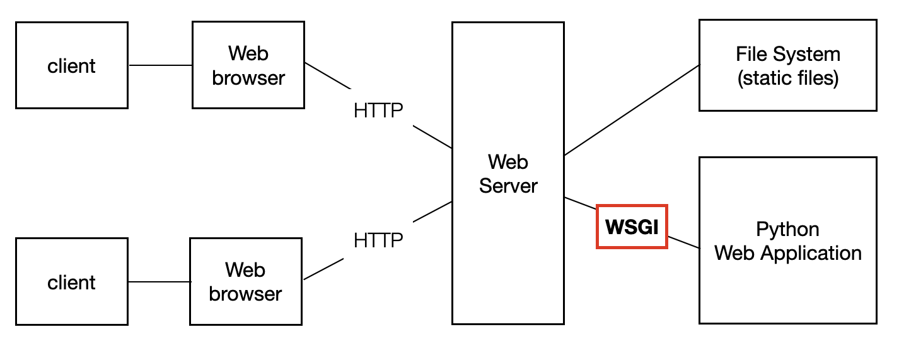

# python module
1. Flask
- 이 방식은 그냥 서로 다른 파일을 연결하는 방식
2. Django
- 기본적인 보안도 되어 있고 DB를 여기서 해결이 가능한거 같다
3. Streamlit / FastAPI
- 이거는 파이썬 코드에서 일일이 다 하는 방식
## 이때까지의 경험
html을 쓰지 않고 python에서 하는 방식을 해봤는데 너무 불편해서 그냥 Flask로 해보자


# Flask 이해
- 기본적으로 WSGI(Web Server Gateway Interface)방식이다
#### WSGI란?

“웹 서버” ↔ “파이썬 코드” 사이의 중간 통역가


# Flask 기본 방식
## python
```
from flask import Flask, render_template

app = Flask(__name__)

@app.route("/")
def home():
    return render_template("index.html", name="홍길동")

if __name__ == "__main__":
    app.run(debug=True)
```
## html
```
<!DOCTYPE html>
<html>
<head>
    <title>홈페이지</title>
</head>
<body>
    <h1>안녕하세요, {{ name }}님!</h1>
</body>
</html>
```